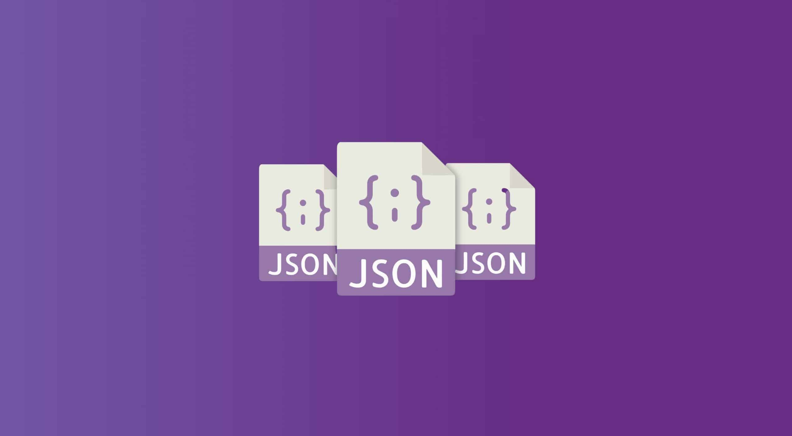

# Praticando

Este repositório tem um objetivo simplesmente didático para que eu possa estar praticando alguns conceitos novos sem importar linguagem, tema, ou qualquer tópico específico de programação.

Tentarei organizar sim, para deixá-lo limpo e de fácil compreensão, mas com fim educacional.

## Algumas das tecnologias que planejo praticar

<figure>
  
  <figcaption><strong>Java</strong><figcaption>
</figure>
  

<figure>
  
  <figcaption><strong>Python</strong><figcaption>
</figure>
  

<figure>
  
  <figcaption><strong>PHP</strong><figcaption>
</figure>
  

<figure>
  
  <figcaption><strong>Javascript</strong><figcaption>
</figure>
  

<figure>
  
  <figcaption><strong>JSON</strong><figcaption>
</figure>
  

### Não se restringindo a uma tecnologia  específica